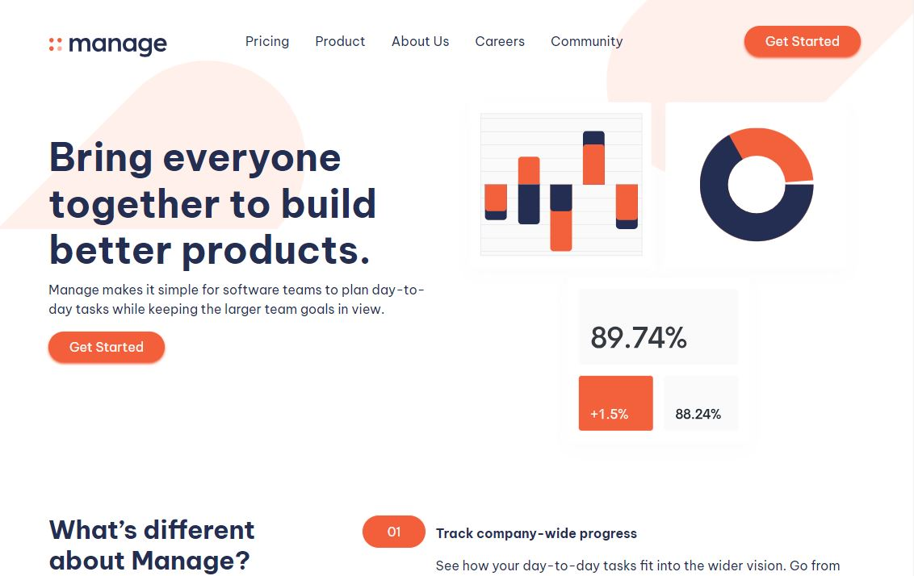

# Frontend Mentor - Manage landing page solution

This is a solution to the [Manage landing page challenge on Frontend Mentor](https://www.frontendmentor.io/challenges/manage-landing-page-SLXqC6P5). Frontend Mentor challenges help you improve your coding skills by building realistic projects.

## Table of contents

- [Overview](#overview)
  - [The challenge](#the-challenge)
  - [Screenshot](#screenshot)
  - [Links](#links)
- [My process](#my-process)
  - [Built with](#built-with)
  - [Continued development](#continued-development)
- [Author](#author)

## Overview

### The challenge

Users should be able to:

- View the optimal layout for the site depending on their device's screen size
- See hover states for all interactive elements on the page
- See all testimonials in a horizontal slider
- Receive an error message when the newsletter sign up `form` is submitted if:
  - The `input` field is empty
  - The email address is not formatted correctly

### Screenshot

### Links

- Solution URL: [You are already here](https://github.com/Techkie-Creations/manage-landing-page-frontendmentor)
- Live Site URL: [Manage Landing Page Frontend Mentor](https://techkie-creations.github.io/manage-landing-page-frontendmentor)

## My process

### Built with

- Semantic HTML5 markup
- CSS custom properties
- Flexbox
- Desktop-first workflow
- [jQuery](https://jquery.com/) - JS Library
- [React](https://react.dev/) - JS Library
- [Bootstrap](https://getbootstrap.com/) - Frontend Style Toolkit

### Continued development

There will be no further development maybe only the styling.

## Author

#### Techkie Creations

- Frontend Mentor - [@Techkie-Creations](https://www.frontendmentor.io/profile/Techkie-Creations)
- Codepen - [@Techkie-Creations](https://codepen.io/Tech--Guy)
- LinkedIn - [@stefan-ngago](https://www.linkedin.com/in/stefan-ngago)
